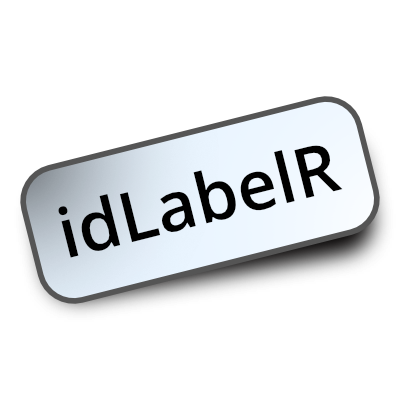

idLabelR 
=========================================================================

The idLabelR package
-----------------

idLabelR provides a tool for generating randomised easy-to-read sample IDs for experiments. The IDs can be formatted for printing to sheets of adhesive labels for easy and clear labelling of samples.

Install
-----------------------------------------------------------------------------------------------------------

``` r
remotes::install_github("rupertoverall/idLabelR")
```

Getting started
----------------------------------------------------------------------------------------------------------------

To get started using idLabelR, have a look at the [quick start guide](https://rupertoverall.net/idLabelR/articles/idLabelR_quickstart_page.html)

For more information, take a look at the [idLabelR website](https://rupertoverall.net/idLabelR)
